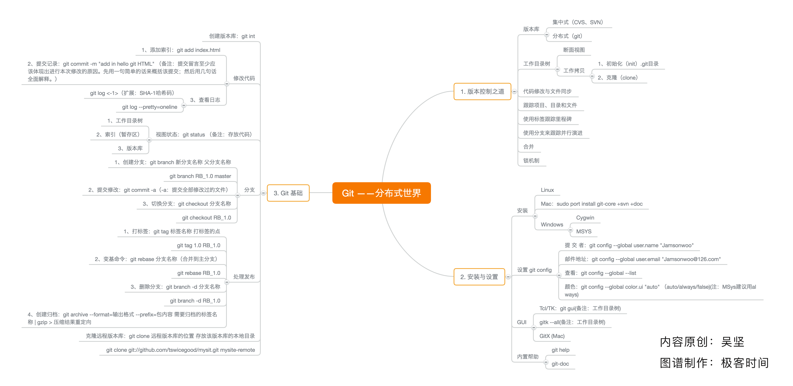
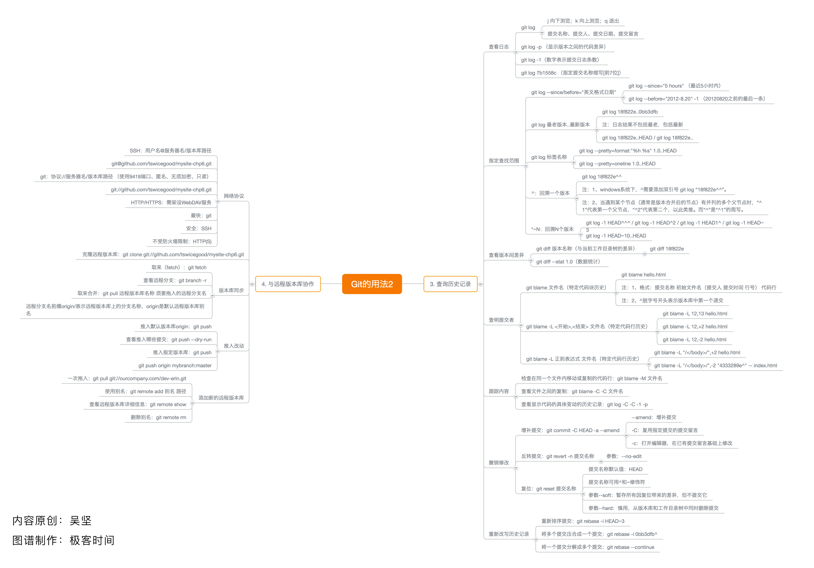
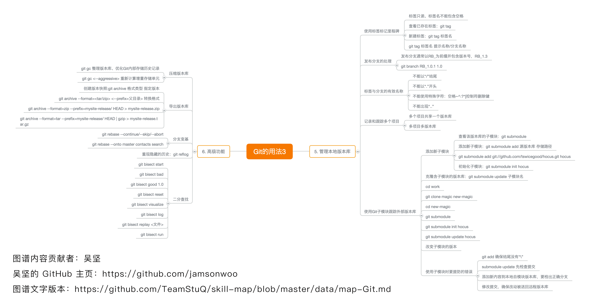

# Git — 分布式版本控制系统

## 下载地址

- 版本控制系统：[Git](https://git-scm.com/)
- GUI 代码仓库：[GitHub Desktop](https://desktop.github.com/)

## 一、寻求帮助

- 帮助信息：git help
- 显示所有的命令：git help -a
- 查看 git 的使用手册：git help -g
- 查看更详细的内容：git help 命令名称/手册名称，如 git help push

## 二、配置

> git 的配置有三个范围
>
> - system-系统范围，在这个级别的配置会影响到整个系统，也就是不管你使用哪个用户登录到系统上，git 都会使用这个系统范围的设置
> - global-全局范围，在这个范围上去配置 git ，不同的用户可以拥有自己的配置
> - local-项目配置，针对单个项目

### 全局配置用户信息

```
添加用户：git config --global user.name "这里输入你的用户名"
添加邮箱：git config --global user.email "这里输入你的邮箱"
查看配置信息：git config --list
删除用户配置：git config --unset --global user.name
删除邮箱配置：git config --unset --global user.email
```

> cat ~/.gitconfig — 全局范围里做的这些配置，会保存在一个叫 .gitconfig 的文件里面。这个文件会放在当前用户的主目录下面，波浪号就表示当前用户的主目录，我们可以使用 cat 命令查看一下这个文件里的东西

## 三、初始化

```
初始化当前目录：git init
进入.git目录（默认是隐藏状态）：cd .git
查看目录下的东西：ls
```

## 四、提交

```
添加指定文件至暂存区：git add 文件名
添加所有文件至暂存区：git add .
提交：git commit -m "该次提交的描述"
查看当前状态：git status
查看以往的提交记录：git log
```

## 五、区别对比

```
显示修改前后的对比：git diff
```

## 六、分支

```
列出所有本地分支：git branch
列出所有远程分支：git branch -r
列出所有本地分支和远程分支：git branch -a
创建一个分支：git branch 分支名
切换分支：git checkout 分支名
合并指定分支到当前分支：git merge 指定分支
重命名分支：git branch -m 旧分支名 新分支名
删除分支：git branch -d 分支名
```

## 七、远程仓库相关

```
推送至远程仓库：git push -u 远程版本库名 推送上去的分支名
克隆项目：git clone 项目链接
```

## 八、Git 思维脑图

1. Git 世界
   

---

1. Git — 用法 1
   

---

2. Git — 用法 2
   

---

3. Git — 用法 3
   
