# flex —— 弹性布局（一维）

> 布局的传统解决方案，基于盒状模型，依赖 display 属性 + position 属性 + float 属性。它对于那些特殊布局非常不方便，比如，垂直居中就不容易实现
>
> 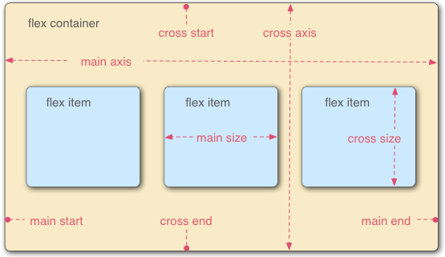
>
> 注意：设为 Flex 布局以后，子元素的 float、clear 和 vertical-align 属性将失效
>
> 参考：https://www.yuque.com/fe9/basic/tlk8ck | http://www.ruanyifeng.com/blog/2015/07/flex-grammar.html

## 1、容器属性

```
.container {
    display: flex | inline-flex;
}

// display：flex；容器对外表现为块级元素
// display：inline-flex；容器对外表现为行内元素
```

1. flex-direction：定义了主轴的方向，即项目的排列方向

   ```
   .container {
       flex-direction: row | row-reverse | column | column-reverse;
   }
   ```

   - row（默认）：主轴在水平方向，起点在左侧，从左到右

     

   - row-reverse：主轴在水平方向，起点在右侧，从右到左

     

   - column：主轴在垂直方向，起点在上沿，从上往下

     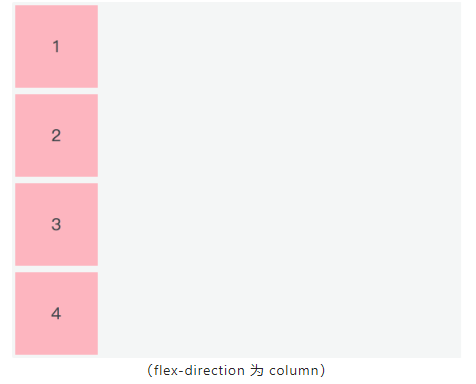

   - column-reverse: 主轴在垂直方向，起点在下沿，从下往上

     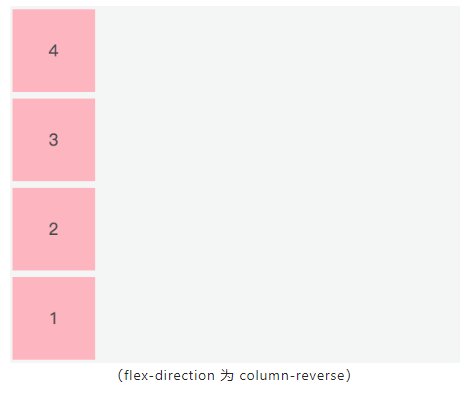

2. flex-wrap：定义当一行放不下时，项目如何换行

   ```
   .container {
       flex-wrap: nowrap | wrap | wrap-reverse;
   }
   ```

   - nowrap（默认）：不换行

     

   - wrap：换行，第一行在上面

     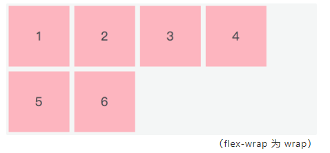

   - wrap-reverse：换行，第一行在下面

     

3. flex-flow：它是 flex-direction 和 flex-wrap 的简写，默认值是 row nowrap

   ```
   .container {
       flex-flow: <flex-direction> || <flex-wrap>;
   }
   ```

4. justify-content：定义了项目在主轴上的对齐方式

   ```
   .container {
       justify-content: flex-start | flex-end | center | space-between | space-around;
   }
   ```

   - flex-start（默认）：与主轴的起点对齐

     

   - flex-end：与主轴的终点对齐

     

   - center：项目居中

     

   - space-between：两端对齐，项目之间的距离都相等

     

   - space-around：每个项目的两侧间隔相等，所以项目与项目之间的间隔是项目与边框之间间隔的两倍

     

5. align-items：定义了项目在交叉轴上如何对齐

   ```
   .container {
       align-items: flex-start | flex-end | center | baseline | stretch;
   }
   ```

   - flex-start：与交叉轴的起点对齐(只看 1、3)

     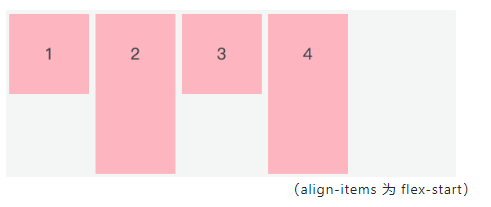

   - flex-end：与交叉轴的终点对齐(只看 1、3)

     

   - center：居中对齐(只看 1、3)

     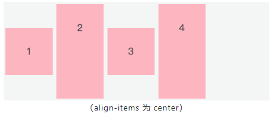

   - baseline：项目第一行文字的基线对齐(1234 基线对齐了)

     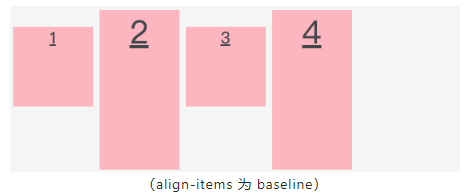

   - stretch（默认）：如果项目未设置高度或者为 auto，项目将占满整个容器的高度

     

6. align-content：定义了多行在交叉轴方向的对齐方式。项目排列只有一行时，该属性不起作用。并且需要设置 flex-wrap: wrap，允许换行

   ```
   .container {
       align-content: flex-start | flex-end | center | space-between | space-around | stretch;
   }
   ```

   - flex-start：与交叉轴的起点对齐

     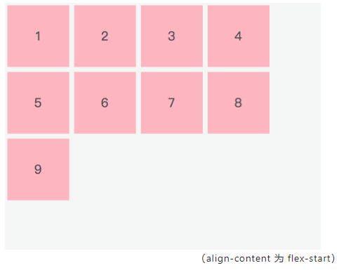

   - flex-end： 与交叉轴的终点对齐

     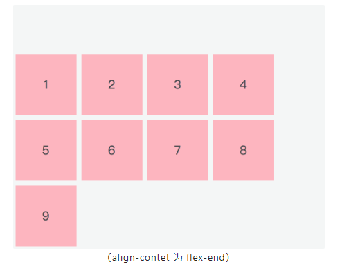

   - center：居中对齐

     

   - space-bteween：与交叉轴两端对齐，轴线之间的距离相等

     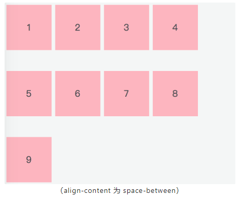

   - space-around：每根轴线两侧的间隔都相等，所以轴线与轴线之间的间隔是轴线与边框之间间隔的两倍

     

   - stretch（默认值）：如果 item 未设置高度或者为 auto，项目将占满整个容器的高度

     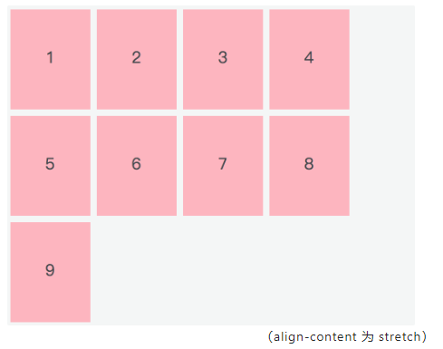

## 2、项目属性

1. order：定义了项目的排列顺序，默认值为 0，数值越小，排列越靠前

   ```
   .item {
       order: <integer>;
   }
   ```

   

2. flex-grow 定义了项目的放大比例，默认为 0，也就是即使存在剩余空间，也不会放大

   ```
   .item {
       flex-grow: <number>;
   }
   ```

   

   

3. flex-shrink：定义了项目的缩小比例（默认为 1）。项目的 flex-shrink 都为 1，当空间不足时，所有项目都将等比缩小；如果其中一个项目的 flex-shrink 为 0，其余都为 1，当空间不足时，flex-shrink 为 0 的不缩小

   ```
   .item {
       flex-shrink: <number>；
   }
   ```

   

   

4. flex-basis：栅格系统，单位可以是像素，也可以是百分比

   ```
   .item {
       flex-basis: <length> | auto;
   }
   ```

   

5. flex：它是 flex-grow、flex-shrink、flex-basis 的缩写，默认值是 0 1 auto，后两个属性可选。该属性有两个快捷值：auto（1 1 auto）和 none（0 0 auto）。auto 代表在需要的时候可以拉伸也可以收缩，none 表示既不能拉伸也不能收缩

   ```
   .item {
       flex: auto | none | [ <'flex-grow'> <'flex-shrink'>? || <'flex-basis'> ]
   }
   ```

6. align-self：定义单个项目与其他项目不一样的对齐方式，可以覆盖 align-items 属性。默认属性值是 auto，即继承父元素的 align-items 属性值。当没有父元素时，它的表现等同于 stretch

   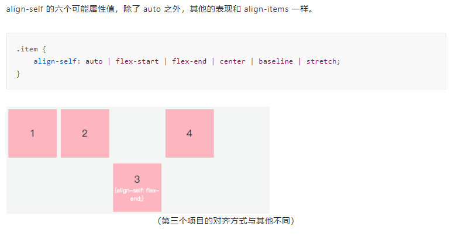

## 3、浏览器兼容性问题

> 因为历史原因，W3C 对 flex 做了多次更新，也就导致了各浏览器支持度参差不齐

这里有一个推荐的兼容性写法：

```
.page-wrap {
    display: -webkit-box;      /* 老语法 iOS 6-, Safari 3.1-6 */
    display: -moz-box;         /* 老语法 Firefox 19- (buggy but mostly works) */
    display: -ms-flexbox;      /* 过渡语法 IE 10 */
    display: -webkit-flex;     /* 新语法 Chrome */
    display: flex;             /* 新语法, Spec - Opera 12.1, Firefox 20+ */
}
```

解释：

```
这种写法有专业的名称--渐进增强

  做法：就是将越新颖越可能不兼容的语法放在后面，将低版本的支持语法放在前面

  效果：这样随着浏览器版本的支持性越强，其最终会显示能够兼容的最高版本语法；而低版本浏览器也能识别器对应能低版本样式语法

  实战：在目前的项目实战中，其实已经很少手写这种代码了，我们理解思想就好，目前的浏览器样式兼容都是通过一系列的loader或者插件在配置目标浏览器时基本都加了兼容写法了。比较常见的插件或者说模块，autoprefixer可以实现这样的需求

  备注：但如果是样式不兼容，想使用另外的一些样式，有少数情况还是需要手动自己加一些代码做渐进增强的
```

## 4、总结

- Flex 布局中容器、项目，主轴、交叉轴
- 容器的六个属性及它们属性值的含义和用法（必学）
- 项目的六个属性及它们属性值的含义和用法（必学）
- Flex 布局在不同版本浏览器中的兼容性问题（兼容性检测：https://caniuse.com/ ）

> 动画演示地址：https://www.html.cn/demo/flexbox-playground/
