# grid —— 网格布局【二维，远比 Flex 布局强大】

> 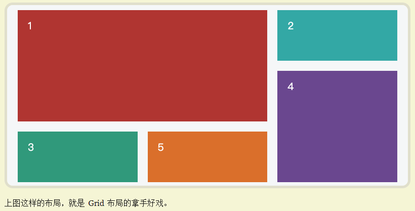
>
> 关系：容器 → 单元格 → 项目
>
> 网格线：正常情况下，n 行有 n + 1 根水平网格线，m 列有 m + 1 根垂直网格线
>
> 注意：设为网格布局以后，容器的 float、inline-block、table-cell、vertical-align 和 column-\*等都将失效
>
> 参考：http://www.ruanyifeng.com/blog/2019/03/grid-layout-tutorial.html

## 1、容器属性

```
div {
  display: grid | inline-grid;
}

// display：grid；容器对外表现为块级元素
// display：inline-grid；容器对外表现为行内元素
```

1. grid-template-columns：定义每一列的列宽，有多少列就有多少个值<br>grid-template-rows：定义每一行的行高，有多少行就有多少个值

   ```
   三行三列：

     <div class="container">
       <div class="item item-1">1</div>
       <div class="item item-2">2</div>
       <div class="item item-3">3</div>
       <div class="item item-4">4</div>
       <div class="item item-5">5</div>
       <div class="item item-6">6</div>
       <div class="item item-7">7</div>
       <div class="item item-8">8</div>
       <div class="item item-9">9</div>
     </div>

     .container {
       display: grid;
       grid-template-columns: 10% 30% 60%;
       grid-template-rows: 150px 100px 200px;
     }
   ```

   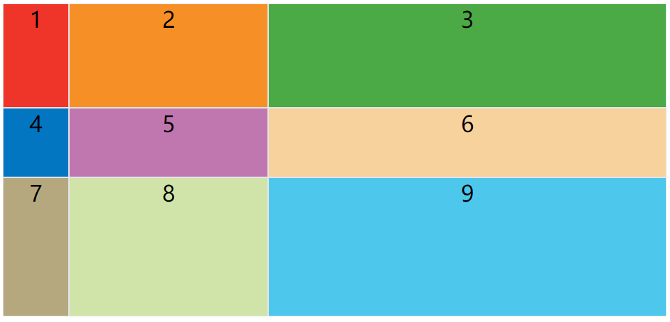

- repeat：技巧之一

  ```
  .container {
    display: grid;
    grid-template-columns: repeat(4, 25%);

    // 相当于grid-template-columns: 25% 25% 25% 25%;
  }
  ```

- auto-fill：有时，单元格的大小是固定的，但是容器的大小不确定。如果希望每一行（或每一列）容纳尽可能多的单元格，这时可以使用 auto-fill 关键字表示自动填充（参考：https://jsbin.com/himoku/edit?css,output ）

  ```
  .container {
    display: grid;
    grid-template-columns: repeat(auto-fill, 100px);
  }
  ```

- fr：为了方便表示比例关系，网格布局提供了 fr 关键字（fraction 的缩写，意为"片段"）。如果两列的宽度分别为 1fr 和 2fr，就表示后者是前者的两倍（参考：https://jsbin.com/hadexek/edit?html,css,output ）

  ```
  .container {
    display: grid;
    grid-template-columns: 1fr 2fr;
  }
  ```

- minmax：minmax()函数产生一个长度范围，表示长度就在这个范围之中。它接受两个参数，分别为最小值和最大值

  ```
  .container {
    display: grid;
    grid-template-columns: 1fr 1fr minmax(100px, 1fr);
  }

  // minmax(100px, 1fr)表示列宽不小于100px，不大于1fr
  ```

- auto：表示由浏览器自己决定长度

  ```
  .container {
    display: grid;
    grid-template-columns: 100px auto 100px;
  }
  ```

- 网格线的名称：grid-template-columns 属性和 grid-template-rows 属性里面，还可以使用方括号，指定每一根网格线的名字，方便以后的引用

  ```
  .container {
    display: grid;
    grid-template-columns: [c1] 100px [c2] 100px [c3] auto [c4];
    grid-template-rows: [r1] 100px [r2] 100px [r3] auto [r4];
  }

  // 上面代码指定网格布局为3行 x 3列，因此有4根垂直网格线和4根水平网格线。方括号里面依次是这八根线的名字
  // 网格布局允许同一根线有多个名字，比如[fifth-line row-5]
  ```

- 布局实例

  - 两栏布局

    ```
    .container {
      display: grid;
      grid-template-columns: 70% 30%;
    }
    ```

  - 三栏布局

    ```
    .container {
      display: grid;
      ggrid-template-columns: 150px auto 200px;
    }
    ```

  - 12 栏网格系统

    ```
    .container {
      display: grid;
      grid-template-columns: repeat(12, 1fr);
    }
    ```

2. row-gap：行间距<br>column-gap：列间距

   ```
   .container {
     row-gap: 20px;
     column-gap: 20px;
   }
   或
   .container {
     gap: 20px 20px;
   }
   ```

3. grid-template-areas：网格布局允许指定"区域"（area），一个区域由单个或多个单元格组成，用于定义区域

   ```
   .container {
     display: grid;
     grid-template-columns: 100px 100px 100px;
     grid-template-rows: 100px 100px 100px;
     grid-template-areas: 'a b c'
                          'd e f'
                          'g h i';
   }
   // 上面代码先划分出9个单元格，然后将其定名为a到i的九个区域，分别对应这九个单元格

   .container {
     display: grid;
     grid-template-columns: 100px 100px 100px;
     grid-template-rows: 100px 100px 100px;
     grid-template-areas: "header header header"
                          "main main sidebar"
                          "footer footer footer";
   }
    // 上面代码中，顶部是页眉区域header，底部是页脚区域footer，中间部分则为main和sidebar
   ```

4. grid-auto-flow：设置项目的放置顺序

   ```
   grid-auto-flow: row | column | row dense | column dense;
   ```

   - row：先行后列

     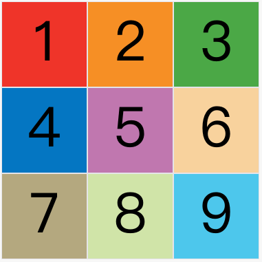

   - column：先列后行

     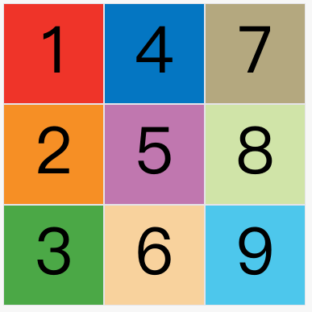

   - row dense | column dense：尽可能紧密填满

     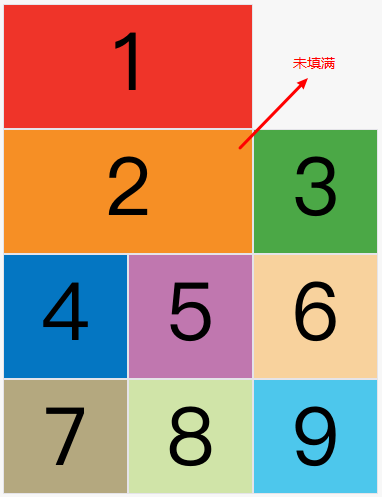

     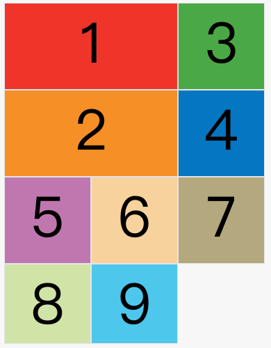

5. justify-items：单元格内的项目的水平位置，作用于所有项目<br>align-items：单元格内的项目的垂直位置，作用于所有项目

   ```
   .container {
     justify-items: start | end | center | stretch;
     align-items: start | end | center | stretch;
   }

   /*
    start：对齐单元格的起始边缘
    end：对齐单元格的结束边缘
    center：单元格内部居中
    stretch：拉伸，占满单元格的整个宽度（默认值）
   */
   ```

   > justify-items: start; 项目在单元格内，左对齐
   >
   > 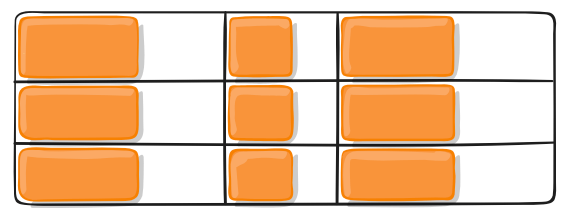

6. justify-content：整个单元格集在容器里面的水平位置<br>align-content：整个单元格集在容器里面的垂直位置

   ```
   .container {
     justify-content: start | end | center | stretch | space-around | space-between | space-evenly;
     align-content: start | end | center | stretch | space-around | space-between | space-evenly;
   }
   ```

   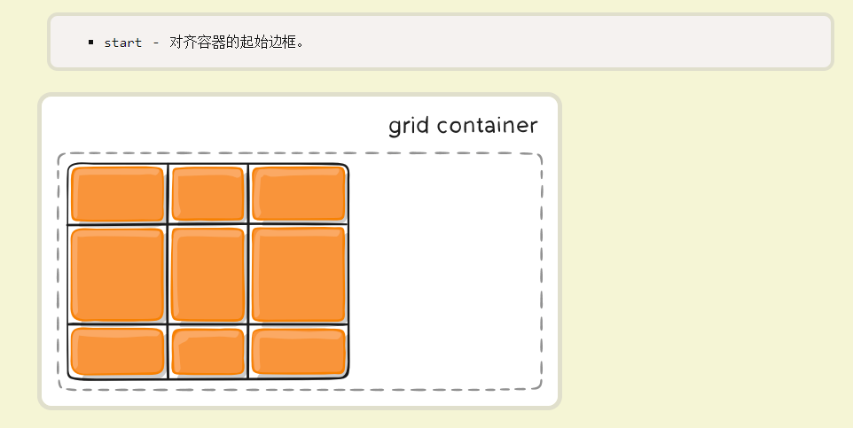

   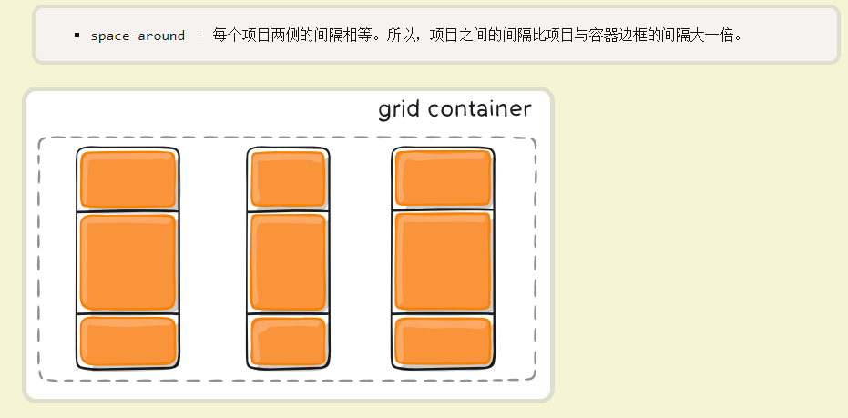

   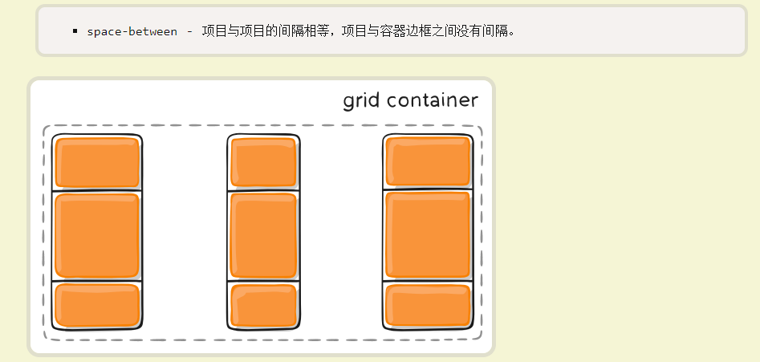

   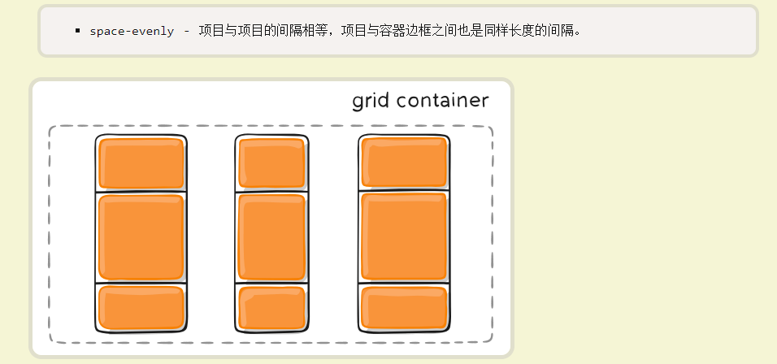

7. grid-auto-columns：设置浏览器自动创建的多余网格的列宽<br>grid-auto-rows：设置浏览器自动创建的多余网格的行高

   > 有时候，一些项目的指定位置，在现有网格的外部。比如网格只有 3 列，但是某一个项目指定在第 5 行。这时，浏览器会自动生成多余的网格，以便放置项目

   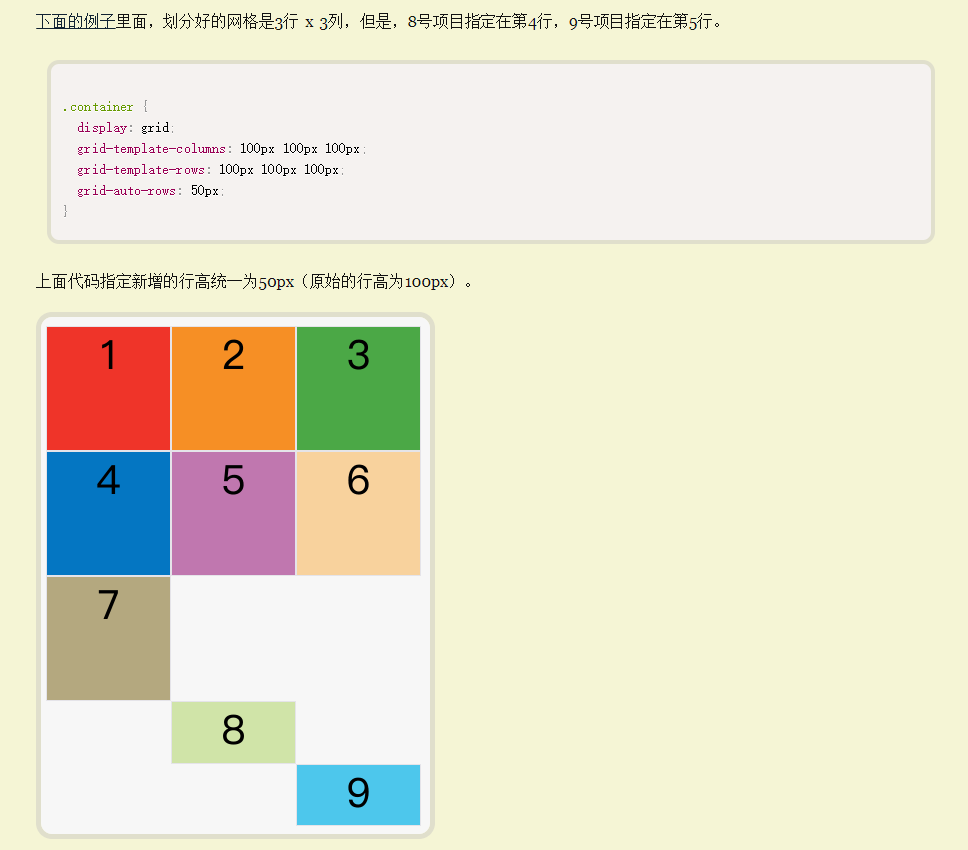

## 2、项目属性

1. 项目的位置是可以指定的，具体方法就是指定项目的四个边框，分别定位在哪根网格线

   - grid-column-start 属性：左边框所在的垂直网格线
   - grid-column-end 属性：右边框所在的垂直网格线
   - grid-row-start 属性：上边框所在的水平网格线
   - grid-row-end 属性：下边框所在的水平网格线

     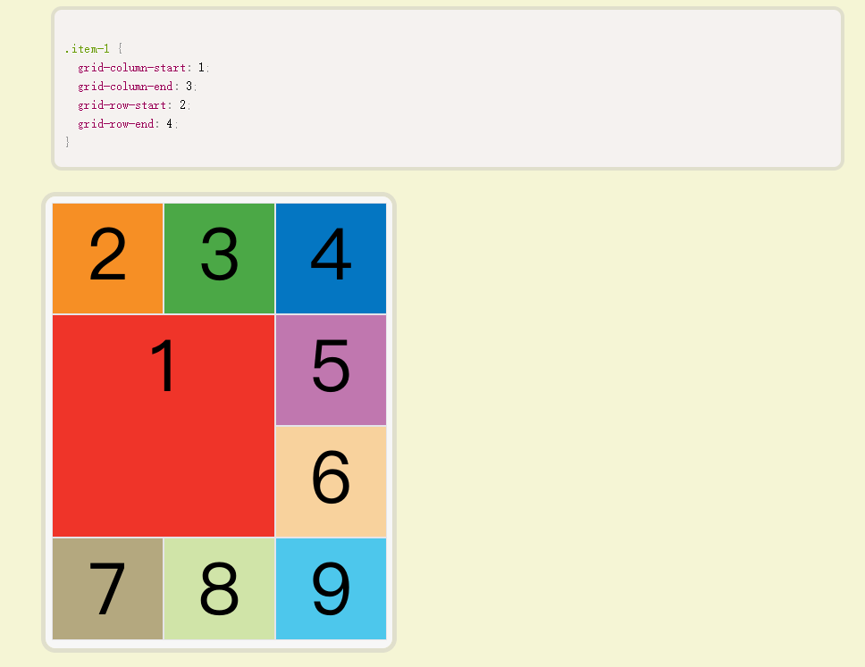

     > 使用这四个属性，如果产生了项目的重叠，则使用 z-index 属性指定项目的重叠顺序

   - span：表示"跨越"，即左右边框（上下边框）之间跨越多少个网格

     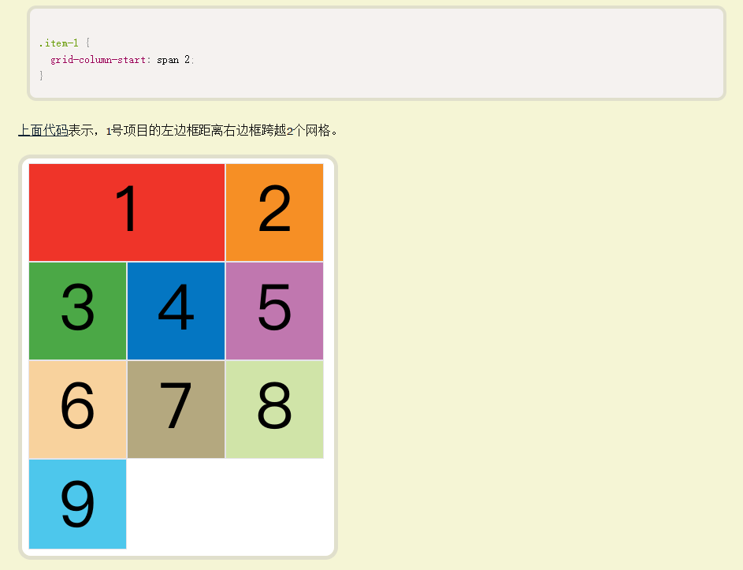

2. grid-area：指定项目放在哪一个区域

   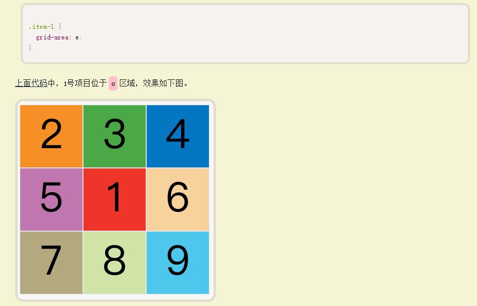

3. justify-self：设置单元格内的项目的水平位置（左中右），跟 justify-items 属性的用法完全一致，但只作用于单个项目<br>align-self：设置单元格内的项目的垂直位置（上中下），跟 align-items 属性的用法完全一致，也是只作用于单个项目

   ```
   .item {
     justify-self: start | end | center | stretch;
     align-self: start | end | center | stretch;
   }

   /*
    start：对齐单元格的起始边缘
    end：对齐单元格的结束边缘
    center：单元格内部居中
    stretch：拉伸，占满单元格的整个宽度（默认值）
   */
   ```

   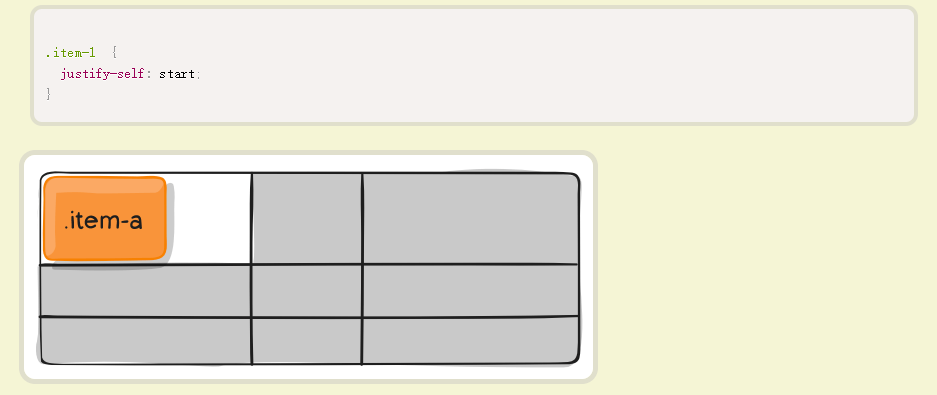
