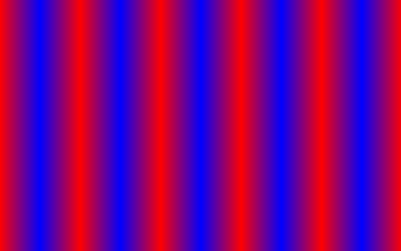

# 渐变

> 定义：两个或多个指定的颜色之间显示平稳的过渡

## 1、线性渐变

### 1.1、向下（默认值）/向上/向左/向右/对角

`background: linear-gradient(direction, color-stop1, color-stop2, ...);`

- direction：方向

### 1.2、角度

`background: linear-gradient(angle, color-stop1, color-stop2, ...);`

- angle：角度，比如 0deg 表示从下到上


### 1.3、透明度

`background: linear-gradient(to right, rgba(255,0,0,0), rgba(255,0,0,1));`

- 用 rgba()即可

### 1.4、颜色百分比

`background: linear-gradient(red 10%, green 85%, blue 90%);`

- 解析：0% ~ 10%是**纯红色**，10% ~ 90%才是**红绿蓝渐变色**，90% ~ 100%是**纯蓝色**

### 1.5、重复渐变

`background: repeating-linear-gradient(color1 数值|百分比, color2 数值|百分比, ...);`



### 1.6、兼容性写法

```css
/* 兼容性写法 */
background: -webkit-linear-gradient(...); /* Safari 5.1 - 6.0 */
background: -o-linear-gradient(...); /* Opera 11.1 - 12.0 */
background: -moz-linear-gradient(...); /* Firefox 3.6 - 15 */
background: (repeating-) linear-gradient(...); /* 标准的语法（必须放在最后） */
```

## 2、径向渐变 - 由它们的中心定义
