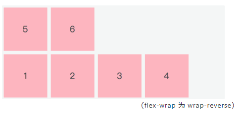
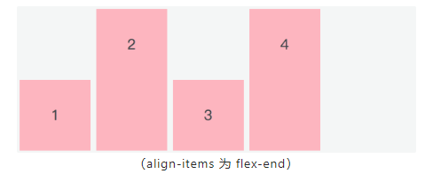
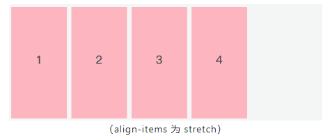
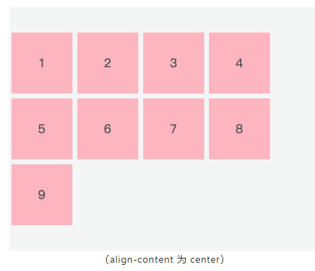
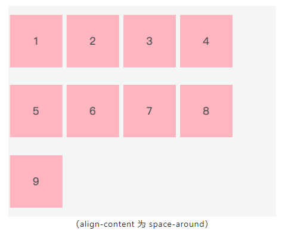

# 布局

## 基因 —— display 属性

- block 块级：霸占整宽，且可以同时作用“上下左右”，即男生
  - div、h、p、ul、ol、dl、table、form、......
- inline 行内：高度和宽度全靠内容撑，只能作用“左右 padding、左右 margin 和左右 border”，即女生
  - span、a、......
- inline-block 行内块级：自适应内容,也可作用“上下左右”，且不会霸占整宽，可以理解为 inline 包裹住 block，即女装大佬
  - img、input、......
- none 隐藏：不显示，不占空间
- inherit：表示这个元素从父元素继承 display 属性值
- flex 弹性盒子：弹性盒布局模型的目的是提供一种更加有效的方式来对一个容器中的子元素进行排列、对齐和分配空白空间

## 定位 —— position

- static 静态定位（默认）：网页中所有的内容都倾向于往网页的左上角流动
- relative 相对定位：相对于自己的出生点偏移【基准点默认在 border 左上角】
- absolute 绝对定位：相对于最近的除 static 定位以外的元素进行定位，在使用时要注意设置父元素（或祖先元素）的 position 属性，若父元素（或祖先元素）都没有设置定位属性，absolute 会找到最上层即 html，相对于它进行定位了
- fixed 固定定位：相对浏览器窗口固定

  

- sticky 粘性定位：元素定位表现为在跨越特定阈值前为 relative 定位，之后为 fixed 定位。参考：http://www.runoob.com/try/try.php?filename=trycss_position_sticky

  

- inherit：继承父元素的 position 属性值

```
小技巧：
    transform: translate(-50%, -50%);把基准点移动到盒子中心
    解析:translate(x, y),向右x轴(0 ~ -100%),向下y轴(0 ~ -100%)
```

## 堆叠

> z-index 属性指定了一个元素的堆叠顺序（哪个元素应该放在前面，或后面）。参考：http://www.runoob.com/try/try.php?filename=trycss_zindex

## float —— 浮动布局

- 盒子一旦 float，这个盒子就拥有 inline-block 特性
- 清除浮动：使用 after 伪元素
  ```
  .row::after {
      content: '';
      display: block;
      clear: both;
  }
  ```
- 栅格系统

## flex —— 弹性布局

> 参考：https://www.yuque.com/fe9/basic/tlk8ck
>
> 通过设置父元素的 display 属性为 display：flex | inline-flex；其子元素便有了伸缩性，即使在子元素的宽高不确定的情况下，也能通过设置相关 css 属性来决定子元素的对齐方式、所占比例和空间分布

### 容器属性

> ```
> .container {
>     display: flex | inline-flex;
> }
> ```
>
> display：flex；容器对外表现为块级元素
>
> display：inline-flex；容器对外表现为行内元素

1. flex-direction：定义了主轴的方向，即项目的排列方向

   ```
   .container {
       flex-direction: row | row-reverse | column | column-reverse;
   }
   ```

   - row（默认）：主轴在水平方向，起点在左侧，从左到右

     

   - row-reverse：主轴在水平方向，起点在右侧，从右到左

     

   - column：主轴在垂直方向，起点在上沿，从上往下

     

   - column-reverse: 主轴在垂直方向，起点在下沿，从下往上

     

2. flex-wrap：定义当一行放不下时，项目如何换行

   ```
   .container {
       flex-wrap: nowrap | wrap | wrap-reverse;
   }
   ```

   - nowrap（默认）：不换行

     

   - wrap：换行，第一行在上面

     

   - wrap-reverse：换行，第一行在下面

     

3. flex-flow：它是 flex-direction 和 flex-wrap 的简写，默认值是 row no-wrap

   ```
   .container {
       flex-flow: <flex-direction> || <flex-wrap>;
   }
   ```

4. justify-content：定义了项目在主轴上的对齐方式

   ```
   .container {
       justify-content: flex-start | flex-end | center | space-between | space-around;
   }
   ```

   - flex-start（默认）：与主轴的起点对齐

     

   - flex-end：与主轴的终点对齐

     

   - center：项目居中

     

   - space-between：两端对齐，项目之间的距离都相等

     

   - space-around：每个项目的两侧间隔相等，所以项目与项目之间的间隔是项目与边框之间间隔的两倍

     

5. align-items：定义了项目在交叉轴上如何对齐

   ```
   .container {
       align-items: flex-start | flex-end | center | baseline | stretch;
   }
   ```

   - flex-start：与交叉轴的起点对齐

     

   - flex-end：与交叉轴的终点对齐

     

   - center：居中对齐

     

   - baseline：项目第一行文字的基线对齐

     

   - stretch（默认）：如果项目未设置高度或者为 auto，项目将占满整个容器的高度

     

6. align-content：定义了多行在交叉轴方向的对齐方式。项目排列只有一行时，该属性不起作用

   ```
   .container {
       align-content: flex-start | flex-end | center | space-between | space-around | stretch;
   }
   ```

   - flex-start：与交叉轴的起点对齐

     

   - flex-end： 与交叉轴的终点对齐

     

   - center：居中对齐

     

   - space-bteween：与交叉轴两端对齐，轴线之间的距离相等

     

   - space-around：每根轴线两侧的间隔都相等，所以轴线与轴线之间的间隔是轴线与边框之间间隔的两倍

     

   - stretch（默认值）：如果项目未设置高度或者为 auto，项目将占满整个容器的高度

     

### 项目属性

1. order：定义了项目的排列顺序，默认值为 0，数值越小，排列越靠前

   ```
   .item {
       order: <integer>;
   }
   ```

   

2. flex-grow 定义了项目的放大比例，默认为 0，也就是即使存在剩余空间，也不会放大

   ```
   .item {
       flex-grow: <number>;
   }
   ```

   

   

3. flex-shrink：定义了项目的缩小比例（默认为 1）。项目的 flex-shrink 都为 1，当空间不足时，所有项目都将等比缩小；如果其中一个项目的 flex-shrink 为 0，其余都为 1，当空间不足时，flex-shrink 为 0 的不缩小

   ```
   .item {
       flex-shrink: <number>；
   }
   ```

   

   

4. flex-basis：栅格系统，单位可以是像素，也可以是百分比

   ```
   .item {
       flex-basis: <length> | auto;
   }
   ```

   

5. flex：它是 flex-grow、flex-shrink、flex-basis 的缩写，默认值是 0 1 auto，后两个属性可选。该属性有两个快捷值：auto（1 1 auto）和 none（0 0 auto）。auto 代表在需要的时候可以拉伸也可以收缩，none 表示既不能拉伸也不能收缩

   ```
   .item {
       flex: auto | none | [ <'flex-grow'> <'flex-shrink'>? || <'flex-basis'> ]
   }
   ```

6. align-self：定义单个项目与其他项目不一样的对齐方式，可以覆盖 align-items 属性。默认属性值是 auto，即继承父元素的 align-items 属性值。当没有父元素时，它的表现等同于 stretch

   ```
   .item {
       align-self: auto | flex-start | flex-end | center | baseline | stretch;
   }
   ```

   

### 小结

- Flex 布局中容器、项目，主轴、交叉轴的含义
- 容器的六个属性及它们属性值的含义和用法
- 项目的六个属性及它们属性值的含义和用法
- Flex 布局在不同版本浏览器中的兼容性问题（兼容性检测：https://caniuse.com/ ）

## 文档流与非文档流

- 三种脱离文档流的方式：
  - float 浮动
  - position：absolute
  - position：fixed

> 区别：
>
> 1. float：使用 float 脱离文档流时，其他盒子会无视这个元素，但其他盒子内的文本依然会为这个元素让出位置，环绕在周围
> 2. absolute 与 fixed：而对于使用 absolute 脱离文档流，其他盒子与其他盒子内的文本都会无视它【也即产生堆叠，此时需要制定 z-index 来决定显示顺序】

## 响应式布局

- 媒体查询(@media) —— “存在即覆盖，不存在则添加”
  ```
  @media (max-width: 480px) {
    background-color: lightgreen;
  }
  ```

> 参考：https://www.yuque.com/fe9/basic/hqbhn3
