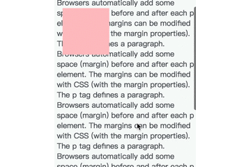

# 布局基础知识

## 一、基因 —— display 属性

- block 块级：霸占整宽，且可以同时作用“上下左右”，即男生
  - div、h、p、ul、ol、dl、table、form、......
- inline 行内：高度和宽度全靠内容撑，只能作用“左右 padding、左右 margin 和左右 border”，即女生
  - span、a、......
- inline-block 行内块级：自适应内容,也可作用“上下左右”，且不会霸占整宽，可以理解为 inline 包裹住 block，即女装大佬
  - img、input、......
- none 隐藏：不显示，不占空间
- inherit：表示这个元素从父元素继承 display 属性值
- flex/inline-flex：一维
- grid/inline-grid：二维

## 二、定位 —— position

- static 静态定位（默认）：网页中所有的内容都倾向于往网页的左上角流动
- relative 相对定位：相对于自己的出生点偏移【基准点默认在 border 左上角】
- absolute 绝对定位：相对于最近的除 static 定位以外的元素进行定位，在使用时要注意设置父元素（或祖先元素）的 position 属性，若父元素（或祖先元素）都没有设置定位属性，absolute 会找到最上层即 html，相对于它进行定位了
- fixed 固定定位：相对浏览器窗口固定

  

- sticky 粘性定位：元素定位表现为在跨越特定阈值前为 relative 定位，之后为 fixed 定位。参考：http://www.runoob.com/try/try.php?filename=trycss_position_sticky

  

- inherit：继承父元素的 position 属性值

```
小技巧：
    transform: translate(-50%, -50%);把基准点移动到盒子中心
    解析:translate(x, y),向右x轴(0 ~ -100%),向下y轴(0 ~ -100%)
```

## 三、堆叠 —— z-index

> z-index 属性指定了一个元素的堆叠顺序（哪个元素应该放在前面，或后面）
>
> 参考：http://www.runoob.com/try/try.php?filename=trycss_zindex

## 四、文档流与非文档流

- 三种脱离文档流的方式：
  - float 浮动
  - position：absolute
  - position：fixed

> 区别：
>
> 1. float：使用 float 脱离文档流时，其他盒子会无视这个元素，但其他盒子内的文本依然会为这个元素让出位置，环绕在周围
> 2. absolute 与 fixed：而对于使用 absolute 脱离文档流，其他盒子与其他盒子内的文本都会无视它【也即产生堆叠，此时需要制定 z-index 来决定显示顺序】

## 五、响应式布局

- 媒体查询(@media)

  > 作用：针对不同的媒体类型定义不同的样式

  ```

  @media (max-width: 480px) {
    background-color: lightgreen;
  }

  // 如果视窗的宽度小于 480px 时，背景色为lightgreen
  ```

  > 参考：http://www.runoob.com/css/css-rwd-mediaqueries.html

- viewport

  > 手机浏览器是把页面放在一个虚拟的"窗口（viewport）"中，通常这个虚拟的"窗口"比屏幕宽，这样就不用把每个网页挤到很小的窗口中（这样会破坏没有针对手机浏览器优化的网页的布局），用户可以通过平移和缩放来看网页的不同部分

  ```
  一个常用的针对移动网页优化过的页面的 viewport meta 标签大致如下：

    <meta name="viewport" content="width=device-width, initial-scale=1.0">
  ```

  > 例子：
  >
  > 有 viewport：http://www.runoob.com/try/demo_source/example_withviewport.htm
  >
  > 无 viewport：http://www.runoob.com/try/demo_source/example_withoutviewport.htm

- 响应式图片

  > 参考：http://www.runoob.com/css/css-rwd-images.html

  ```
  img {
    max-width: 100%;
    width: 500px;
  }

  

  // max-width 属性设置为 100%, 图片永远不会大于其原始大小
  ```

- 响应式视频

  > 参考：http://www.runoob.com/css/css-rwd-videos.html

## 六、网格系统

> 很多网页都是基于网格设计的，这说明网页是按列来布局的
>
> - 12 栏系统
> - 24 栏系统
> - ......
