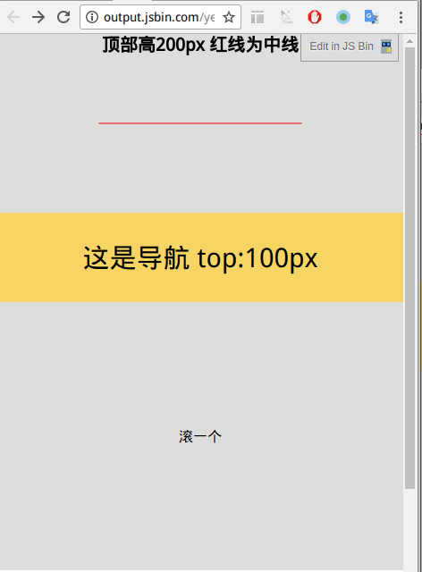

# 布局

## 基因 —— display 属性

- block 块级：霸占整宽，且可以同时作用“上下左右”，即男生
  - div、h、p、ul、ol、dl、table、form、......
- inline 行内：高度和宽度全靠内容撑，只能作用“左右 padding、左右 margin 和左右 border”，即女生
  - span、a、......
- inline-block 行内块级：自适应内容,也可作用“上下左右”，且不会霸占整宽，可以理解为 inline 包裹住 block，即女装大佬
  - img、input、......
- none 隐藏：不显示，不占空间
- inherit：表示这个元素从父元素继承 display 属性值
- flex 弹性盒子：弹性盒布局模型的目的是提供一种更加有效的方式来对一个容器中的子元素进行排列、对齐和分配空白空间

## 定位 —— position

- static 静态定位：默认情况下，网页中所有的内容都倾向于往网页的左上角流动
- relative 相对定位：相对于自己的出生点偏移【基准点默认在 border 左上角】
- absolute 绝对定位：相对于最近的除 static 定位以外的元素进行定位，在使用时要注意设置父元素（或祖先元素）的 position 属性，若父元素（或祖先元素）都没有设置定位属性，absolute 会找到最上层即 html，相对于它进行定位了
- fixed 固定定位：相对浏览器窗口固定

  

- sticky 粘性定位：元素定位表现为在跨越特定阈值前为 relative 定位，之后为 fixed 定位。参考：http://www.runoob.com/try/try.php?filename=trycss_position_sticky

  

- inherit：继承父元素的 position 属性值

```
小技巧：
    transform: translate(-50%, -50%);把基准点移动到盒子中心
    解析:translate(x, y),向右x轴(0 ~ -100%),向下y轴(0 ~ -100%)
```

## 堆叠

> z-index 属性指定了一个元素的堆叠顺序（哪个元素应该放在前面，或后面）。参考：http://www.runoob.com/try/try.php?filename=trycss_zindex

## float

- 盒子一旦 float，这个盒子就拥有 inline-block 特性
- 清除浮动：使用 after 伪元素
  ```
  .row::after {
      content: '';
      display: block;
      clear: both;
  }
  ```
- 栅格系统

## 文档流与非文档流

- 三种脱离文档流的方式：
  - float 浮动
  - position：absolute
  - position：fixed

> 区别：
>
> 1. float：使用 float 脱离文档流时，其他盒子会无视这个元素，但其他盒子内的文本依然会为这个元素让出位置，环绕在周围
> 2. absolute 与 fixed：而对于使用 absolute 脱离文档流，其他盒子与其他盒子内的文本都会无视它【也即产生堆叠，此时需要制定 z-index 来决定显示顺序】

## CSS 命名规则

参考：https://biaoyansu.com/9.convention
