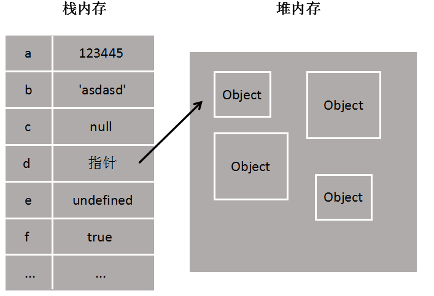

# 数据类型

## 1、数据类型的分类

- **值类型**（栈内存）：String 字符串、Number 数值、Boolean 布尔值、Null 空值、Undefined 未定义、symbol 独一无二的值......

- **引用类型**（堆内存）：Object 对象、Array 数组、Function 函数......

> **重点：**
>
> 1. 栈内存中保存了**变量名、值类型、堆地址（指针）**，大小固定；堆内存中保存了**引用类型**，大小不固定
> 2. 值类型复制，会开辟新的栈内存；引用类型复制分为浅拷贝（默认）与深拷贝



### 1.1 值类型识别：typeof（返回字符串）

- `typeof 数值` // number

- `typeof 字符串` // string

- `typeof 布尔型` // boolean

- `typeof undefined` // undefined

- `typeof null` // object

- `typeof symbol` // symbol

- `typeof function` // function

> typeof 只能识别值类型和 function，返回字符串
> 注意：null 是 object，空对象引用（空指针）

### 1.2 引用类型识别：instanceof（返回布尔值）

语法：object（要测试的对象） instanceof constructor（构造函数）

- `[1,2] instanceof Array` // true
- `[1,2] instanceof Object` // true

> 1. instanceof 可以识别引用类型
> 2. 更重的一点是 instanceof 可以在继承关系中用来判断一个实例是否属于它的父类型

## 2、数据类型详解

### Number 数字

- 整型
- 浮点型
- ±Infinity
- NaN
  - isNaN()函数来判断，返回布尔值

### Null 空值

- 逻辑角度看，null 值表示一个空对象指针
- 判断是否为 null 最佳方法：直接和 null 进行"==="比较

  ```js
  console.log(null === null); //true
  console.log(undefined === null); //false
  console.log("null" === null); //false
  ```

### Undefined 未定义

- 出现场景
  - 已声明未赋值的变量
  - 获取对象不存在的属性
  - 无返回值的函数的执行结果
  - 函数的参数没有传入
  - void(expression)

### Object 对象

- 获取对象中的 value
  - 对象.key
  - 对象["key"]

## 3、类型的转换

### 3.1 强制转换

- ==>String

  1. 用“+”
  2. toString()：该方法不会影响到原变量（null 和 undefined 没有该方法）
     `变量.toString()`
     注意：null 和 undefined 这两个值没有 toString()方法
  3. String()
     `String(变量)`

- ==>Number

  1. Number()
     `Number(变量)`
  2. parseInt() 与 parseFloat()：字符串 ==> 整数/浮点数

- ==>Boolean

  > 日常开发中，以下变量会被转换为 false

  - 0
  - NaN
  - ' '
  - null
  - undefined
  - false 本身

### 3.2 隐式转换

- 字符串拼接 “+”
- ==
- if 语句：如何快速判断一个变量将会被 if 转换为什么呢？答案是 `!!变量`
- 逻辑运算：&& || !

## 4、== 与 ===

- "=="运算符会尝试进行一些类型转换，再比较值
- "==="比较过程没有任何类型转换，比较类型和值

## 5、浅拷贝与深拷贝

> 浅拷贝和深拷贝一般是针对引用类型

- 浅拷贝：不开辟新的堆内存，复制的是堆地址
  

- 深拷贝：开辟新的堆内存
  

## 6、JS 垃圾收集和内存管理机制（了解下即可）

> 作用：清除无用数据，释放内存
>
> 原理：给变量打上标记，生命周期结束后释放内存，周期性自动执行

- 打上标记策略

  1. 标记清除（主流）：类似于变量作用域的生命周期，即离开作用域的值将被标记为可回收
  2. 引用计数：跟踪变量的引用计数，变为 0 时即可清除

- JS 会控制 Web 浏览器占用内存 < 桌面应用程序。全局变量无用后，最好手动设置 null 来释放
