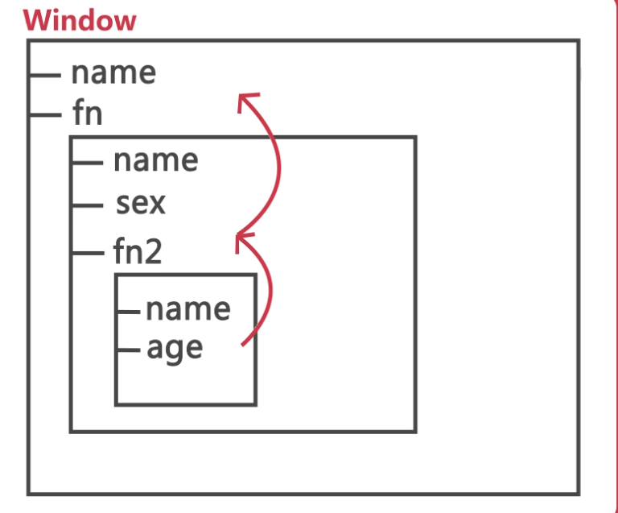

# 作用域

> 定义：变量起作用的区域
>
> **注意**：JS 没有块级作用域，`{}`就称为一个块，例如 if、for 语句等

## 1、全局作用域

- 生命周期：全局作用域在页面打开时创建，在页面关闭时销毁

- 在全局作用域中有一个全局对象 window，它代表的是一个浏览器的窗口，它由浏览器创建我们可以直接使用

  - 创建的**全局变量**都会作为 window 对象的属性保存
  - 创建的**全局函数**都会作为 window 对象的方法保存

    ```js
    var name = "BS";
    function fn(argument) {
      var sex = "man";
      function fn1(argument) {
        var age = 20;
      }
    }
    // name和fn是全局变量
    name === window.name; // true
    fn === window.fn; // true
    ```

## 2、局部作用域（函数内部，包括形参）

- 生命周期：局部作用域在函数执行时创建，在函数执行完后销毁

## 3、作用域链

> 从内往外：先从当前作用域查找，找不到再往外去查找（也即同名变量，越往内优先级越高）

```js
var name = "a";
function fn(argument) {
  var name = "b";
  var sex = "man";
  function fn2(argument) {
    var name = "c";
    var age = 20;
  }
}
```



## 4、声明提升（JS 的预解析机制）

1. 变量和函数在内的所有声明都会在任何代码被执行前首先被提升
2. 提升到自身作用域的顶部（不会超出该层作用域）
3. 第一个声明是在编译阶段由编译器进行的。第二个赋值操作会被留在原地等待引擎在执行阶段执行（没有赋值提升这说法）

### 4.1 变量声明提升

> 只 var 变量，而不赋值，其值默认等于 undefined

```js
//
var who = "A";
var age = 20;
function fn(argument) {}
  console.log(who);
  var who = "B";
  var age = 30;
}
fn(); // undefined

// 变量声明提升后，变成下面这样
var who;
var age;
who = "A";
age = 20;
function fn(argument) {
  var who;
  var age;
  console.log(who);
  who = "B";
  age = 30;
}
fn(); // undefined
```

```js
// 没有var，则不会进行变量声明提升。报错：who is not defined
console.log(who);
who = "A";
```

### 4.2 函数声明提升

```js
// 结果：1
foo();
function foo() {
  console.log(1);
}

// 函数声明提升后，代码变成下面这样。结果：1
function foo() {
  console.log(1);
}
foo();
```

**但是：函数表达式却不会提升**

```js
// 结果：foo is not a function
foo();
var foo = function() {
  console.log(1);
};

// 变量声明提升后，但是函数表达式不会提升，代码变成下面这样。因为没有赋值，结果同上
var foo;
foo();
foo = function() {
  console.log(1);
};
```

**即使是具名的函数表达式也无法被提升**

```js
// 结果：TypeError: foo is not a function
foo();
var foo = function bar() {
  console.log(1);
};

// 变量声明提升后，代码变成下面这样。结果同上
var foo;
foo();
foo = function bar() {
  console.log(1);
};
```

### 4.3 函数覆盖

> 函数声明提升**优先于**变量声明提升

```js
// 1.1 函数声明和变量声明都会被提升。但是，函数声明会覆盖变量声明
var a;
function a() {}
console.log(a); //结果：'function a(){}'

// 1.2 如果变量存在赋值操作，则最终的值为变量的值
var a = 1;
function a() {}
console.log(a); // 结果：1
// 也即
var a;
function a() {}
console.log(a); //'function a(){}'
a = 1;
console.log(a); // 结果：1
```

```js
// 2 后面的函数声明会覆盖前面的函数声明
a(); // 结果：2
function a() {
  console.log(1);
}
function a() {
  console.log(2);
}
```
