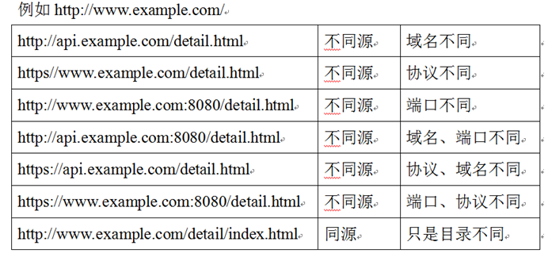

# Ajax

## 1、同步与异步

- 同步：提交请求->服务器处理->处理完毕返回（这期间浏览器不能做其他事情）
- 异步：提交请求->服务器处理（此时浏览器可以做其他事情）->触发响应事件处理

## 2、为什么需要 Ajax？

> 我们在访问一个普通的网站时，当浏览器加载完 HTML、CSS、JS 等文件以后，网站的内容就固定了
> Ajax 出现之前，如果想让网站内容发生更改，就必须刷新重载页面。Ajax 实现了异步加载，无需重新加载整个网页的情况下，进行局部更新

## 3、原生 js 发送 Ajax 请求的 5 个步骤

1. 实例化一个 XMLHttpRequest 对象（**核心**）
   - 不阻塞，且可进行局部更新
2. 创建请求，`open(method,url,[async],[user],[password])`

   - method：要使用的 HTTP 方法，比如 GET、POST 等
   - url：请求的 url
   - async：异步请求 true（默认值）；同步请求 false（**不建议**）
   - user：用户名，用于认证
   - password：用户密码，用于认证

3. 发出请求，`send([content])`

   - content：发送给服务器的内容，**仅用于 POST 请求**

4. 注册 onreadystatechange 事件，当 readyState 属性改变时就会调用其事件句柄

   | readyState 值 | 描述             |
   | :-----------: | ---------------- |
   |       0       | 对象已实例化完毕 |
   |       1       | 服务器连接已建立 |
   |       2       | 请求已接收       |
   |       3       | 正在下载响应内容 |
   |       4       | 下载完毕         |

5. 获取返回的数据
   - responseText：获得字符串形式的响应数据（**常用**）
   - responseXML：获得 XML 形式的响应数据

```js
/* get请求 */
var xhr;
// 【1】实例化一个 XMLHttpRequest 对象
if (window.XMLHttpRequest) {
  // IE7+, Firefox, Chrome, Opera, Safari
  xhr = new XMLHttpRequest();
} else {
  // IE6-
  xhr = new ActiveXObject("Microsoft.XMLHTTP");
}
// 【2】创建请求
xhr.open("GET", "/api/hello");
// 【3】发出请求
xhr.send();
// 【4】当 readyState 属性改变时，就会调用该事件句柄
xhr.onreadystatechange = function() {
  if (xhr.readyState === 4 && xhr.status === 200) {
    // 【5】获取返回的数据
      console.log(xhr.responseText);
      console.log("请求成功");
    } else {
      console.log("请求失败");
    }
  }
};
```

- **注意**

  - 如果需要像 HTML 表单那样 POST 数据，请使用 setRequestHeader() 来添加 HTTP 头，然后在 send() 方法中规定您希望发送的数据

    ```js
    xhr.open("POST", "/try/ajax/demo_post2.php");
    xhr.setRequestHeader("Content-type", "application/x-www-form-urlencoded");
    xhr.send("fname=Henry&lname=Ford");
    ```

  - async 设置为异步 true：在等待服务器响应时执行其他脚本，当响应就绪后对响应进行处理

  - 必须使用 post 的情况
    1. 无法使用缓存文件（更新服务器上的文件或数据库）
    2. 向服务器发送大量数据（post 没有数据量限制）
    3. 发送包含未知字符的用户输入时（post 比 get 更稳定可靠）

## 4、XMLHttpRequest Level 2

XMLHttpRequest 升级版，新增了如下内容：

- 可以设置 HTTP 请求的超时时间
- 可以通过 FormData 发送表单数据
- 可以上传文件
- 支持跨域请求
- 可以获取服务器端的二进制数据
- 可以获得数据传输的进度信息

## 5、jq 操作 Ajax

1. `$(selector).load(URL,data,callback);` 从服务器加载数据，并把返回的数据放入被选元素中
2. `$.get(URL,callback);` 通过 GET 请求从服务器上请求数据
3. `$.post(URL,data,callback);` 通过 GET 请求从服务器上请求数据
4. `$.ajax({name:value, name:value, ... })` 所有的 jQuery AJAX 方法都使用 ajax() 方法

   ```js
   $.ajax({
     url: "01.php", //请求地址
     data: "name=fox&age=18", //发送的数据
     type: "GET", //请求的方式
     success: function(argument) {}, // 请求成功执行的方法
     beforeSend: function(argument) {}, // 在发送请求之前调用,可以做一些验证之类的处理
     error: function(argument) {
       console.log(argument);
     } //请求失败调用
   });
   ```

## 6、json

> 轻量级、易读的文本数据交换格式，取代繁琐的 XML

1. 语法

   > 必须使用双引号" "

   - key-value 对
   - 各键值对用逗号分隔
   - 大括号保存对象
   - 中括号保存数组

2. 值的数据类型

   > key 必须是字符串

   - 数字（整数或浮点数）
   - 字符串（在双引号中）
   - 布尔值（true 或 false）
   - 数组（在中括号中）
   - 对象（在大括号中）
   - null

3. json 字符串 与 js 对象

   - JSON.parse(text,[reviver])：将 json 字符串转化为 js 对象

     - text:一个有效的 json 字符串
     - reviver: 一个转换结果的函数，将为对象的每个成员调用此函数

     ```js
     // 解析前要确保你的数据是标准的 JSON 格式，否则会解析出错
     var jsObj = JSON.parse('{ "name":"runoob", "site":"www.runoob.com" }');
     ```

   - JSON.stringify(value,[replacer,[space]])：将 js 对象转化为 json 字符串

     - value：要转换的 js 值（通常为对象或数组）

     ```js
     var Obj = {
       name: "fox",
       age: 18,
       skill: "撩妹"
     };

     // 将 js 对象格式化为 JSON 字符串
     var jsonStr = JSON.stringify(Obj);
     ```

## 7、JSONP

- 同源策略是浏览器的一种安全策略，所谓同源是指域名、协议、端口完全相同



- JSONP 是 json 的一种"使用模式"，可以跨域读取数据

1. 本质是利用了`<script src=""></script>`标签具有可跨域的特性
2. 代码实现

   ```php
   /* 服务器端代码 */
   <?php
   header('Content-type: application/json');
   //获取回调函数名
   $mycallback = htmlspecialchars($_REQUEST ['callback']);
   //json数据
   $json_data = '["customername1","customername2"]';
   //输出jsonp格式的数据
   echo $mycallback . "(" . $json_data . ")";
   ?>
   ```

   ```html
   <!-- 浏览器端代码 -->
   <script type="text/javascript">
     function callbackFunction(data) {
       console.log(data);
     }
   </script>
   <script
     type="text/javascript"
     src="http://www.runoob.com/try/ajax/01.php?callback=callbackFunction"
   ></script>
   ```

3. 解析

   1. `callback`是前后端的约定，之后会执行`callbackFunction`函数
   2. `callbackFunction`中的参数 data 就是服务端返回的数据

4. jq 实现 JSONP

   ```html
   <script>
     $.getJSON("http://www.runoob.com/try/ajax/01.php?callback=?", function(
       data
     ) {
       console.log(data);
     });
   </script>
   ```
